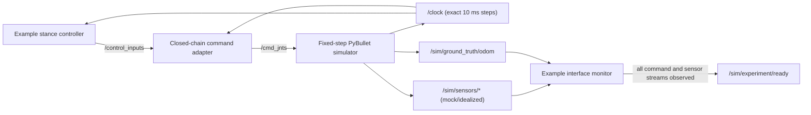

# Robot Dog

Robot Dog is a ROS 2 learning project built around a custom quadruped. The repository currently contains a simplified robot description, a headless PyBullet teaching stack, a ROS-independent MuJoCo simulator core, and a basic inverse-kinematics command adapter. It is being revived as an environment for learning robot control, navigation, state estimation, and robot learning.

This baseline targets **ROS 2 Jazzy on Ubuntu 24.04**. The previous project used ROS 2 Humble; Humble may still work, but it is not the reproducible target used by CI.

## Current status

| Area | Status |
| --- | --- |
| Development environment | Reproducible ROS 2 Jazzy devcontainer and pinned Python dependencies |
| Robot description | Simplified open-chain Xacro/URDF with 12 actuated joints |
| Simulation | Headless PyBullet teaching node plus a deterministic, ROS-independent MuJoCo reset/step core |
| Control | Per-leg IK plus a deterministic, gentle stance-height example controller |
| Visualization | Robot state publisher, optional RViz, and a Foxglove bridge on port `8765` |
| Tests | ROS package tests plus an end-to-end command/sensor headless smoke test |
| MuJoCo | Stable primitive baseline plus an optional evidence-bounded enhanced model, fixed-step reset/step, compatible idealized teaching data, separate ground truth, and headless determinism coverage for both |
| State estimation, navigation, learning | No estimator or environment yet; a PyBullet teaching interface is available |
| Hardware and firmware | Not present in this repository |

Both simulators are development checkpoints, not validated models of the physical robot. Their sensors are noise-free/mock outputs, and there is no hardware sensor model, state estimator, learning environment, controller benchmark, or dynamics validation yet.

## Quick start

The supported path is the included devcontainer. It pins the ROS base image and Python runtime dependencies and avoids depending on the workstation's ROS installation.

1. Install Docker and a devcontainer-compatible editor or CLI.
2. Clone this repository and open it in the devcontainer.
3. Build, test, and smoke-test the existing simulator:

   ```bash
   make build
   make test
   make mujoco-smoke
   make smoke
   ```

4. Start the simulator and Foxglove bridge:

   ```bash
   make experiment
   ```

`make experiment` runs the safe example stance command and the interface monitor. Use `make sim` when you want the simulator/controller stack without an autonomous example command; the simulator still publishes the teaching sensor topics.

The devcontainer runs `make build` after creation. Stop a running launch with `Ctrl-C`.

### Native ROS installation

On a machine with ROS 2 Jazzy already installed:

```bash
make setup
make build
make test
make smoke
make experiment
```

`make setup` installs dependencies declared by the ROS packages and creates `.venv` with the pinned packages from `requirements.txt`. It does not install ROS itself.

## Remote visualization

PyBullet runs headlessly. The normal remote-workstation workflow is to render in Foxglove on your local machine:

1. Run `make experiment` on the workstation.
2. Forward TCP port `8765`. VS Code forwards it automatically from the devcontainer, or use SSH:

   ```bash
   ssh -L 8765:localhost:8765 USER@REMOTE_HOST
   ```

3. Open the Foxglove desktop or web application locally and connect to `ws://localhost:8765`.

RViz is disabled by default because it requires a graphical display. On a machine with a working display, start it with:

```bash
make sim SIM_ARGS="use_rviz:=true use_foxglove:=false"
```

## Developer commands

| Command | Purpose |
| --- | --- |
| `make setup` | Resolve ROS dependencies and install pinned Python dependencies |
| `make build` | Build `robot_ws` using a symlink install |
| `make test` | Run all package tests and print the complete result summary |
| `make mujoco-smoke` | Run identical headless trajectories on both MuJoCo variants and require exact equality, finite sensors, and foot contact |
| `make mujoco-record` | Generate short headless APNG review animations for both MuJoCo variants in `robot_ws/log/mujoco-review` |
| `make smoke` | Verify simulation time, clean TF, commands, sensors, forces, and truth |
| `make sim` | Launch PyBullet, the joint controller, robot state publisher, and Foxglove |
| `make experiment` | Add the deterministic example controller and interface monitor |

ROS commands accept a different installed distribution through `ROS_DISTRO`, for example `ROS_DISTRO=humble make build`. Jazzy remains the tested target. `make mujoco-smoke` is deliberately ROS-independent.

## Phase 2 MuJoCo core and Phase 3 model layer

The MuJoCo path is a small simulator core, not a ROS node or learning algorithm. It exposes ordinary Python `reset()`, `step(command)`, and `observe()` methods. Each `step` advances exactly one fixed 2 ms physics tick. Each `reset` restores the same keyframe, holds the safe stance through a fixed number of settling steps, resets episode time to zero, and returns copied data.

```python
from robot_simulation.mujoco_core import MujocoSimulator

simulator = MujocoSimulator()
initial = simulator.reset()
result = simulator.step({'Revolute_25': 0.47})

# Optional Phase 3 model; public commands and results are unchanged.
enhanced = MujocoSimulator(model_variant='enhanced')

mock_imu = result.sensors.imu
evaluation_pose = result.ground_truth.position_world
```

Commands use the same 12 explicit simplified-model joint names as `/cmd_jnts`. A partial command updates named targets and omitted joints hold their previous targets. Unknown, duplicate, non-finite, and out-of-range targets are rejected instead of silently changing command meaning. `MujocoSimulator.safe_stance_command()` returns the full conservative target set.

The returned interface deliberately separates data by intended use:

| Field | Semantics |
| --- | --- |
| `result.sensors.imu` | Ideal orientation, body-frame angular velocity, and body-frame specific force; no noise, bias, saturation, or estimator claim |
| `result.sensors.joint_states` | Ideal named position, velocity, and actuator effort in canonical command order |
| `result.sensors.foot_contacts[foot]` | Per-foot contact flag, summed normal force, and simulated force/torque about the foot site in the foot frame |
| `result.ground_truth` | Exact base pose and body-frame velocity, isolated in a separate object for evaluation |

The [model provenance and approximation guide](robot_ws/src/robot_simulation/robot_simulation/models/README.md) describes both variants. `primitive` remains the default known-stable fixture. `enhanced` uses masses, inertia tensors, centers of mass, and joint anchors traced to the checked-in Xacro/URDF export, plus bounded primitive envelopes derived from the checked-in STL bounds. It deliberately retains conservative teaching limits and actuator/contact tuning where the repository lacks credible hardware facts. Neither variant reconstructs the physical closed chain or validates dynamics against hardware.

MuJoCo itself is pinned, and both models fix timestep, integrator, solver, iteration count, tolerance, friction cone, and reset state. Focused tests and `make mujoco-smoke` exercise both variants with numerical invariants rather than visual inspection. Exact replay is required within the supported environment; bitwise identity across different MuJoCo versions, CPU architectures, or compiler builds is not promised.

`make mujoco-record` produces a bounded four-second APNG and final-contact poster for each variant plus an HTML index and JSON manifest. The camera, sample cadence, safe-stance command, and physics stepping are fixed; feet turn green when the existing public contact interface reports contact. CI uploads this directory as `mujoco-phase3-review-<commit>` for 14 days. Rasterization can vary across graphics drivers, so the artifact is supplemental review evidence and never replaces deterministic numeric tests.

ROS and Gymnasium adapters are intentionally deferred. An eventual adapter should translate this core's existing command/result objects at the boundary rather than add ROS timing or learning-framework state to the core.

## PyBullet teaching experiment

The experiment launch is deliberately small. It is an interface for learning how control and state-estimation data move through a robot stack; it is **not** a state estimator and does not claim hardware fidelity.



The example controller repeats a gentle, symmetric 4 mm stance-height cycle. It generates the same sample sequence every cycle and stays within the current adapter's configured joint limits. PyBullet advances with a fixed 10 ms physics step and publishes `/clock`; sensor and command headers use exact integer multiples of that step. Workstation scheduling can change the real-time factor, but not the published simulation timeline. This remains a teaching simulator, not a hard real-time system.

### Topic semantics

| Topic | Type | Meaning |
| --- | --- | --- |
| `/clock` | `rosgraph_msgs/msg/Clock` | Step-derived simulation time, advanced exactly 10 ms after each PyBullet step. Experiment/controller/visualization nodes use `use_sim_time=true`; the simulator's wall timer stays independent so it can advance the clock. |
| `/control_inputs` | `sensor_msgs/msg/JointState` | Physical closed-chain angles in radians. Numeric names `0..11` use leg order front-right, rear-right, rear-left, front-left, with three angles per leg. |
| `/cmd_jnts` | `sensor_msgs/msg/JointState` | Adapter output addressed by explicit simplified-URDF joint names. |
| `/sim/sensors/imu` | `sensor_msgs/msg/Imu` | Ideal orientation, body-frame angular velocity, and body-frame specific force at `base_link`; no noise, bias, saturation, or covariance model. |
| `/sim/sensors/joint_states` | `sensor_msgs/msg/JointState` | Ideal PyBullet joint position, velocity, and applied motor torque. `/joint_states` mirrors it for ROS visualization compatibility. |
| `/sim/sensors/foot_contacts/<foot>` | `std_msgs/msg/Bool` | Binary plane contact for `front_left`, `front_right`, `rear_left`, or `rear_right`. |
| `/sim/sensors/foot_contacts/<foot>/normal_force` | `std_msgs/msg/Float64` | Sum of PyBullet normal contact forces for that foot, in newtons. |
| `/sim/sensors/foot_contacts/<foot>/wrench` | `geometry_msgs/msg/WrenchStamped` | Ideal PyBullet normal-plus-friction force in the corresponding foot-link frame, with torque about that link's origin. |
| `/sim/ground_truth/odom` | `nav_msgs/msg/Odometry` | Exact `sim_ground_truth_world -> sim_ground_truth_base_link` pose and body-frame twist. These deliberately distinct frames keep truth out of the operational estimator tree. |
| `/sim/experiment/ready` | `std_msgs/msg/Bool` | The monitor has received every stream, headers track the advancing step clock, command names match measured joints, and at least one foot reports nonzero normal force. |

Contact and force values come directly from the simplified PyBullet collision model. They are mock simulation data, not a model of a load cell, force-sensitive resistor, or any real hardware sensor.

The simulator does **not** publish exact truth as `world -> base_link` TF. The normal robot TF tree remains rooted at `base_link` for a future estimator to connect to `odom` or `map`. For visualization/debugging only, `make experiment SIM_ARGS="publish_ground_truth_tf:=true"` publishes the same truth pose in the isolated `sim_ground_truth_world -> sim_ground_truth_base_link` tree; it never claims the operational `base_link` frame.

### First learning exercise: contact-aided vertical velocity

Create a new node that subscribes to the IMU, joint states, and four foot-contact/normal-force topics. Rotate IMU specific force into your estimator's inertial frame, add gravity, and integrate vertical acceleration. When at least two feet have stable contact above a small force threshold, apply a zero-vertical-velocity update. Plot the estimate against `/sim/ground_truth/odom`, but never subscribe to ground truth inside the estimator itself. Then add configurable IMU bias/noise in your exercise node and observe how the contact update changes drift.

This exercise teaches frame transforms, IMU conventions, contact gating, and evaluation separation. It is only a starting point for a contact-aided estimator; it does not account for slip, contact uncertainty, kinematic velocity constraints, or filter consistency.

## Repository layout

```text
.
├── .devcontainer/       # Pinned ROS 2 Jazzy development image
├── .github/workflows/   # Build, test, and simulation smoke CI
├── foxglove_config/     # Existing Foxglove layout
├── robot_ws/src/
│   ├── robot_controller # Leg kinematics and ROS command adapter
│   ├── robot_desc       # Simplified Xacro/URDF and visualization launch
│   └── robot_simulation # PyBullet ROS stack plus deterministic MuJoCo core/model
├── scripts/             # Reusable setup/build/test/run entry points
├── Makefile
└── requirements.txt
```

## Robot-description history

The physical leg uses a closed kinematic chain, which URDF cannot represent directly because URDF requires a tree. The active description therefore uses a simplified three-joint serial leg and software maps the physical joint geometry to it.

An older, more detailed open-chain export of the mechanism exists in Git history, but it is not part of the runnable baseline and the loop-closure constraints were never completed. The planned MuJoCo work should recover that description deliberately, reduce the very dense CAD meshes, and represent the missing loop closures with MuJoCo equality constraints while retaining a simplified URDF for ROS tooling.

## Revival roadmap

1. **Reproducible baseline** — repeatable environment, declared dependencies, CI, and a verified PyBullet launch. This repository state covers that phase.
2. **MuJoCo vertical slice** — the ROS-independent core now loads one canonical simplified model, resets/steps deterministically, applies named joint commands, and exposes idealized sensor data with separate ground truth. Rendering and adapters remain deferred.
3. **Model fidelity** — an optional enhanced open-chain model now introduces repository-exported mass/inertia and geometry structure with explicit provenance and approximations. Detailed mechanism recovery, loop closure, system identification, and hardware validation remain future work.
4. **Robotics interfaces** — the idealized sensor teaching slice has started this phase; state estimators, navigation interfaces, and controller benchmarks remain.
5. **Learning environment** — Gymnasium-style reset/step API, observations/actions/rewards, reproducible experiments, and ROS adapters at the boundary.

## Project history

The original project progressed from a Matplotlib stick model to simple walking and trotting experiments on the physical robot, then explored Gazebo and `ros2_control` before moving to PyBullet. The current code captures only a portion of that work: the simplified robot model, basic leg IK, and the initial ROS/PyBullet bridge.

Maintainers listed by the original project:

- [Mostafa Hussein](https://www.linkedin.com/in/mostafa-hussein-04/)
- [Vinesh Vivekanand](https://www.linkedin.com/in/vinesh-vivekanand/)
- [Armaan Rasheed](https://www.linkedin.com/in/armaan-rasheed-530229a0/)

## License

No repository-level license is currently declared. Package metadata records this as `NOASSERTION`; do not assume permission to redistribute until the maintainers choose and add a license.
